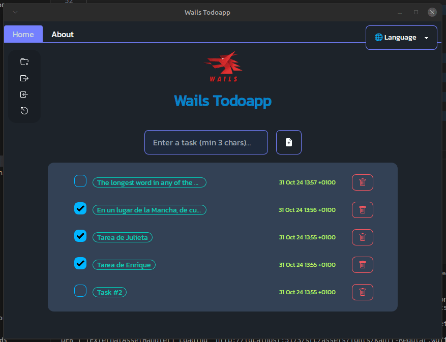

<div align="center">

# Wails Todoapp

<p style="margin-bottom: 16px;">
    Golang desktop todoapp that uses Wails GUI framework and Svelte to build the frontend.
</p>


<br />

 

</div>

<hr />

### Features 🚀

<div align="center" style="margin-bottom: 16px;">



</div>

- [x] **Using the [Wails](https://wails.io/) GUI framework:** `Wails` is a framework  that enables you to write desktop apps using Go and web technologies. This in itself allows you to immediately apply all your acquired knowledge if you come from the Web world, that's why we can consider it a lightweight and fast Electron alternative for Go. You can easily build applications with the flexibility and power of Go, combined with a rich, modern frontend. Wails supports cross-compilation for various platforms, native menus, dialogs and theming, use of various JavaScript frameworks for building the frontend, live development mode using the power of Vite, and a powerful CLI to easily create, build, and package applications, among many other [features](https://wails.io/docs/introduction#features).
- [x] **Using `SQLite3` as a database:** `SQLite` is an embedded SQL database engine that we have chosen for application data persistence.
- [x] **Possibility to export/import data to/from `.csv` format:** The application generates a file (`task.csv`) in the folder where the executable is located when we export the data. Comma-separated values (`CSV`) is a text file format that uses commas to separate values, and newlines to separate records. A `CSV` file stores tabular data (numbers and text) in plain text, where each line of the file typically represents one data record. To import such data, the file (generated by the application or by us in the appropriate format for reading) must also be located in the folder where the executable is located. Two libraries are used to perform the export/import:
    - **[sqltocsv](https://github.com/joho/sqltocsv)** a library designed to let you easily turn any arbitrary sql.Rows result from a query into a CSV file with a minimum of fuss.
    - **[csv](https://github.com/earthboundkid/csv)** a Golang CSV reader like Python's DictReader, which converts the read .csv file into a `[]map[string]string` which is later used to create the query that will populate a new table in the database.
- [x] **Using the [SevelteJS](https://svelte.dev/) frontend framework:** `Sevelte` is a UI framework to let you write breathtakingly concise components that do minimal work in the browser. It is the framework mainly recommended for the creation of GUIs by the creators of `Wails` given its ease of use, mainly in combination with `TypeScript`.
- [x] **Using the [svelte-i18n](https://github.com/kaisermann/svelte-i18n) library:** `svelte-i18n` helps you localize your app using the reactive tools `Svelte` provides. By using `stores` to keep track of the current `locale`, `dictionary` of messages and to `format` messages, we keep everything neat, in sync and easy to use on your svelte files. `svelte-i18n` makes translation management simple. It does so by using JSON files that help your app easily switch between different languages. Indeed, the use of the `Wails` framework, which uses Web interfaces, greatly facilitates some common tasks in desktop applications such as their translation. Some online tools can help you with JSON file translation, such as [`Translate i18next JSON resources/files`](https://translate.i18next.com/).
- [x] **Using [`Tailwindcss`](https://tailwindcss.com/) and its plugin [`daisyUI`](https://daisyui.com/):** to allow you to style your application easily and quickly, and they also integrate seamlessly with `Svelte` and `Wails`.


<br />

---

### 👨‍🚀 Getting Started:

#### Installing the application

If you don't have Go, you can download the appropriate executable for your platform from [here](https://github.com/emarifer/go-wails-svelte-desktop-todoapp/releases). Once unpacked, you can place it in the folder where your system normally stores executables (although you could place it in any directory). Then, you just need to update the system PATH with that address. For Linux, if you run the Makefile ("make user-install" to install to ~/.local/, or "make user-uninstall" to uninstall) you can easily install the application for the user or on the system ("sudo make install/uninstall").

If you already have Go installed (Go 1.20 or higher is required) and you want to modify code and/or build the binaries yourself, you will need to meet some prerequisites. You will need to consult the `Wails` documentation to install the dependencies required by your platform (see [here](https://wails.io/docs/gettingstarted/installation)). Obviously, for compiling and installing frontend dependencies you also need to have `NodeJs` installed which comes with the `npm` package manager (npm (Node 15+)).

`Wails` has the advantage of having a powerful [`CLI`](https://wails.io/docs/reference/cli/) that makes it very easy to generate the scaffolding to start an application, to develop with hot reload, and to build and package it into a single binary, in addition to the already mentioned cross-compilation for different platforms. So it is highly recommended to install it with the command:

```
$ go install github.com/wailsapp/wails/v2/cmd/wails@latest
```

From this point on, if you have met the above requirements, you can clone the repository and run the following command in the project folder to start the application in development mode:

```
$ wails dev
```

This allows hot reloading by saving modified code and monitoring the results, both in the launched application and in a browser (at the address `http://localhost:34115`). Right-clicking on the opened application window allows you to choose between several options, including opening a development tools panel equivalent to the devtools of the `Chrome` browser.

Finally, if you want to build the application executable by packaging everything, including the application icon and all assets (fonts, images, etc.) just run the command:

```
$ wails build
```

This will build the binary into the `build/bin` folder. However, for choosing other build options or performing cross-compiling, you may want to take a look at the Wails [CLI documentation](https://wails.io/docs/reference/cli/).

>[!NOTE]
>***As mentioned above I have created for the Linux version a compressed `.tar.xz` file with the application and a Makefile that acts as an 'installer' that installs the executable, a `desktop entry` to create an entry in the `Start Menu` and the corresponding application icon. For the Windows version, the binary is simply compressed as a `.zip` inside a folder called `dist/`. If you prefer, you can generate both compressed files by running the project's `Makefile`: "make create-bundles"***

---

### Happy coding 😀!!